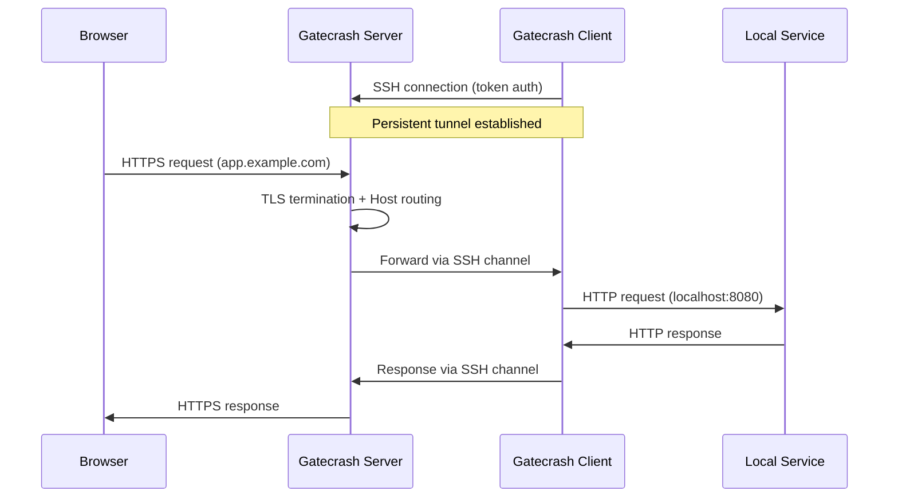
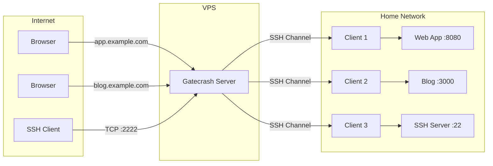
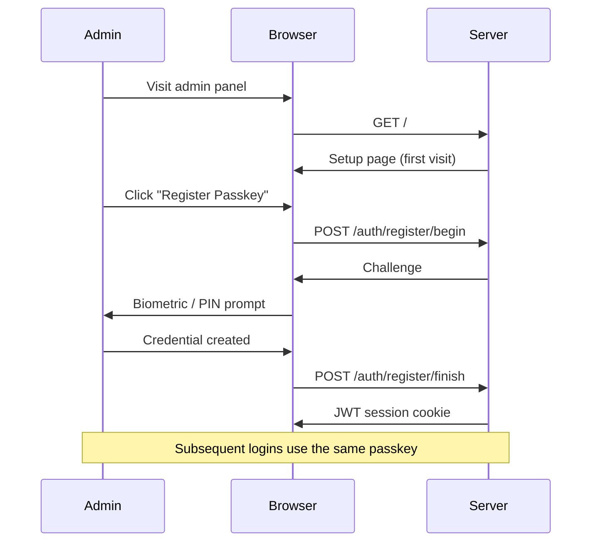
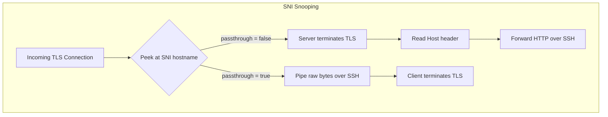

# Gatecrash: Vibe Coding a Self-Hosted Tunnel Server

If you've read my previous posts, you know I use tunnels heavily for my self-hosted projects. I like shielding my home IP from the internet. I like the ability to move services between machines without reconfiguring firewalls or relying on static internal IPs. Tunnels give me that flexibility.

[Watch on YouTube](https://www.youtube.com/watch?v=EnT3EGuZ6b8)

The existing options are good, but none of them quite felt *right*. [Cloudflare Tunnels](https://developers.cloudflare.com/cloudflare-one/connections/connect-networks/) are amazing, but I've always felt a bit uneasy handing over the keys to all my traffic. And while you *can* tunnel TCP through Cloudflare, it requires running `cloudflared` on the client (making it impractical for public-facing git or game servers, for example). It's really an HTTP-first solution. [Tailscale Funnel](https://tailscale.com/kb/1223/funnel) has similar limitations and doesn't let me use my own domains. There are self-hosted options like [frp](https://github.com/fatedier/frp), but none of them clicked for me.

What I actually wanted was pretty specific: a self-hosted tunnel server where I can expose both HTTP *and* raw TCP services — things like SSH, SMTP, game servers, on my own VPS, forwarding traffic to machines on my home network. These aren't high-volume, ultra-critical, lowest-latency-possible services. They're personal infrastructure. These are my services.  I just want to control the whole stack.  Oh, and I want a pretty UI.  And super easy-to-use Docker sidecar for the clients. 

The problem was always time. I love coding. I love designing software. But building something like this from scratch (a secure transport layer, traffic forwarding, the TLS certificate management, the admin panel, the authentication, the CI/CD pipeline) that's a lot. It's the kind of project that I've thought about for years... 

Vibe coding changed that.

Working with [Claude Code](https://docs.anthropic.com/en/docs/claude-code), I was able to focus on the parts I had the strongest opinions on: the architecture, the product design, the user experience. Instead of spending hours wiring up WebAuthn flows or fighting with certificates, I could describe what I wanted and iterate on the design. It let me be the architect instead of the bricklayer.  Turns out, I quite enjoyed it!  

Is the result the *best* tunnel server out there? No, certainly not. Is it bulletproof? Probably not — although it's looking reasonably solid. The heavy lifting is done by well-tested libraries (CertMagic for TLS, `go-webauthn` for Passkeys, `gliderlabs/ssh` for the SSH server). Gatecrash is really just the glue that holds them together in an opinionated way.

But it *exists*. And it works. And I had a blast building it.

## What is Gatecrash?

[Gatecrash](https://github.com/jclement/gatecrash) is a self-hosted tunnel server. It lets you expose a local service (running on your homelab, a Raspberry Pi, behind a NAT) to the public internet through a server you control, with automatic TLS via Let's Encrypt.

Think of it like a self-hosted ngrok: you run the server on a VPS, point some DNS at it, and then connect clients from wherever your services are running.



### HTTP and TCP Tunnels

Gatecrash supports two tunnel types:

**HTTP tunnels** route traffic based on the `Host` header. You assign one or more hostnames to a tunnel, and the server automatically obtains TLS certificates and routes matching requests through the SSH connection to your client. For services that handle their own TLS, there's also a passthrough mode where the server routes by SNI without terminating TLS (more on that below).

**TCP tunnels** forward raw TCP on a dedicated port. This is useful for things like SSH, game servers, or anything that isn't HTTP. (This is something that other offerings like Cloudflare Tunnels or Tailscale Funnels don't support well)



## Tech Decisions

### A Single Binary

Gatecrash compiles down to a single static binary. Server and client are the same executable. You just run `gatecrash server` or `gatecrash client`. All static assets (HTML templates, CSS, JavaScript, fonts) are embedded into the binary using Go's `embed` package.

```go
//go:embed templates static
var embeddedFS embed.FS
```

No runtime dependencies. No external files to manage. Copy the binary to a server, run it, done. This was a deliberate design choice. I wanted deployment to be as simple as possible.  Yeah, I know, it's a bit silly because the client now contains all these assets too (unnecessarily) which wastes memory on the edge machines.. Meh.  Ram is (errr.  was) cheap.

Built with `CGO_ENABLED=0` for maximum portability. The same binary runs on any Linux box without worrying about glibc versions or shared library dependencies.

### SSH for Transport

Using SSH as the transport layer was one of the early decisions that shaped the whole project. SSH gives you:

- **NAT traversal for free**: the client initiates the connection, so it works behind any firewall
- **Encryption built-in**: no need to layer on additional TLS for the tunnel itself
- **Mature protocol**: battle-tested, well-understood, great library support in Go
- **Multiplexed channels**: multiple requests flow through a single connection

Authentication uses a simple token format (`tunnel_id:secret`), where the secret is bcrypt-hashed in the server config. The client connects, authenticates, and keeps the connection alive with periodic heartbeats. If the connection drops, exponential backoff handles reconnection gracefully.

One thing I really like about this design: the server doesn't specify what local service gets exposed. That's entirely a client-side decision. The server just knows "tunnel X has hostnames Y and Z." The client decides what to point those at. This always made me uneasy with Cloudflare Tunnels. If someone gained access to your Cloudflare account, they could change the tunnel config and potentially expose services you never intended to be public. With Gatecrash, the server can't reach into your network. It can only forward traffic through the tunnel the client chose to open.

### Passkeys First

I've always hated adding user authentication to my projects. A basic password is easy, but then you need the surrounding stuff: reset workflows, emails, password strength validation. It's a pain. I want Passkeys to catch on, so why not make this Passkey-only?

No emails. No passwords. No "forgot password" flow. The admin panel uses [Passkeys](https://passkeys.dev/) (WebAuthn/FIDO2) exclusively.



On first visit, you register a passkey. From then on, authentication is a single biometric prompt (fingerprint, face, security key, whatever your device supports). It's phishing-resistant, there are no credentials to leak, and the UX is genuinely better than passwords.

> **Note:** Passkey credentials are stored as a simple JSON file on the server. No database required.

### The Frontend Journey

What I really wanted was a single static CSS file I could drop in and get pretty styling. No build chain, no `node_modules`, just a `<link>` tag and go.

**[PicoCSS](https://picocss.com/)** almost got me there. It's brilliant for what it does: you write stock HTML with no classes and it just *looks good*. For a simple settings page or a static site, it's perfect. But the Gatecrash admin panel is an information-dense, live-updating dashboard with tables, status indicators, modals, and responsive layouts. PicoCSS wasn't built for that.

**[Bulma](https://bulma.io/)** gave me more control, but I just couldn't make it look *pretty*. Everything came out functional but bland.

So I caved and reached for **[Tailwind CSS](https://tailwindcss.com/)**. I wanted to avoid Tailwind's build chain, but it's just so damn nice to work with. Once you're in the flow of utility classes, building a good-looking responsive interface is *fast*. The compiled CSS gets embedded in the binary, so end users never see the build step anyway.

Combined with **[Alpine.js](https://alpinejs.dev/)** for lightweight interactivity (toggle states, form handling, SSE listeners), the frontend is simple and snappy without a JavaScript framework or bundler in sight.

The admin panel uses server-rendered HTML templates with sprinkles of Alpine for dynamic behavior — things like live tunnel status updates via Server-Sent Events, passkey management, and in-app update checks.

```html
<!-- Live tunnel status via SSE -->
<div x-data="tunnelStatus()" x-init="connect()">
  <template x-for="tunnel in tunnels">
    <div>
      <span x-text="tunnel.id"></span>
      <span x-show="tunnel.connected" class="text-green-500">Connected</span>
      <span x-show="!tunnel.connected" class="text-red-500">Offline</span>
    </div>
  </template>
</div>
```

### TLS: Server or Client Termination

Every HTTPS connection starts with a TLS ClientHello, and that handshake includes the [SNI (Server Name Indication)](https://en.wikipedia.org/wiki/Server_Name_Indication) extension — the hostname the client wants to reach. Gatecrash peeks at this SNI value *before* completing the handshake, and uses it to decide how to handle the connection. This gives you two modes:

**Server-side TLS termination** is the default. Gatecrash uses [CertMagic](https://github.com/caddyserver/certmagic) (the same library that powers Caddy) to automatically obtain and renew Let's Encrypt certificates. The server terminates TLS, inspects the HTTP `Host` header, and forwards plain HTTP through the SSH tunnel to your client. This is the simple path. Your local service doesn't need to know anything about TLS.

**Client-side TLS termination** (passthrough mode) is for cases where your backend handles its own TLS. Maybe it has its own certificate, or you want true end-to-end encryption without the server seeing plaintext traffic. In passthrough mode, the server snoops the SNI to figure out which tunnel to route to, then pipes the raw TCP bytes straight through. It never completes the TLS handshake itself. Your local service handles all of that.



This decision happens per-tunnel, so you can mix both modes on the same server.

## GitHub Actions and Releases

The CI/CD pipeline handles everything:

- **On push to main**: build, vet, lint (`staticcheck`), and run tests with race detection
- **On tag**: [GoReleaser](https://goreleaser.com/) builds binaries for Linux, macOS, and Windows (amd64 + arm64), publishes Docker images to GHCR, and creates a GitHub Release

```yaml
# .github/workflows/release.yml (simplified)
- uses: goreleaser/goreleaser-action@v6
  with:
    args: release --clean
```

This means every release is a single `git tag` away from producing binaries for six platform/arch combinations and multi-arch Docker images. GoReleaser is wonderful for this.

## Getting It Running

Let me walk through getting a real tunnel up and running from scratch.

### Server Setup

I provisioned a new Digital Ocean VPS ($4/mo) and got an IP: `143.110.209.180`. Then I added a wildcard A record for `*.onewheelgeek.org` pointing at that IP.

On the server, it's a one-liner:

```bash
curl -fsSL https://raw.githubusercontent.com/jclement/gatecrash/main/deploy/install.sh | sh
```

The installer downloads the right binary for your architecture, creates a `gatecrash` system user, sets up a hardened systemd service, and starts it. It'll ask for your admin hostname. I chose `admin.onewheelgeek.org`. Once the installer completes, hit that in your browser to see the dashboard and register your first passkey.

> **Warning:** As with any `curl | sh` install, you should read the script before running it. It's short and straightforward. [Take a look](https://github.com/jclement/gatecrash/blob/main/deploy/install.sh).

### Creating a Tunnel

After registering a passkey in the admin panel, I added a new tunnel for `test1.onewheelgeek.org`. You just provide the hostname and whether you want TLS passthrough:


This generates the secret tokens you'll need for the client:


### Running the Client

Back on my home network (behind a firewall), I set up a quick Docker Compose stack with a [whoami](https://github.com/traefik/whoami) test service and a Gatecrash client as a sidecar.

`.env`:

```bash
GATECRASH_SERVER=admin.onewheelgeek.org:60735
GATECRASH_TOKEN_ID=test-app
GATECRASH_TOKEN_SECRET=jV1zPPQd7N0p8H4iLMJqZdECceNgLl9Xm8r9TXMZNAM
```

`docker-compose.yml`:

```yaml
services:
  whoami:
    image: traefik/whoami

  tunnel:
    image: ghcr.io/jclement/gatecrash:latest
    command: ["./gatecrash", "client"]
    environment:
      GATECRASH_SERVER: ${GATECRASH_SERVER}
      GATECRASH_TOKEN: ${GATECRASH_TOKEN_ID}:${GATECRASH_TOKEN_SECRET}
      GATECRASH_TARGET: whoami:80
    depends_on:
      - whoami
```

`docker compose up` and the client connects to the server. Hit `test1.onewheelgeek.org` in the browser, there's a brief delay as it automatically provisions a TLS certificate, and then we're off to the races.


### Self-Updating

The binary can also update itself:

```bash
gatecrash update
```

It checks GitHub releases, downloads the latest version for your platform, and replaces itself. No package manager needed.

## The Vibe Coding Story

Say what you will about vibe coding, and there is LOTS to be said... I know.. This project wouldn't exist without vibe coding. The surface area is too large for the evenings-and-weekends time budget I have for side projects. SSH protocol handling, WebAuthn flows, ACME certificate management, Alpine.js components, Tailwind layouts, systemd service files, GoReleaser configs, install scripts. Each of these is a rabbit hole.

What vibe coding gave me was the ability to stay at the design level. I could think about *what* the product should do and *how* it should feel, rather than getting lost in implementation details. When I wanted passkey auth, I didn't need to spend a weekend reading the WebAuthn spec. When I wanted live tunnel status, I didn't need to debug SSE connection handling. I could describe the behavior I wanted, review the result, and iterate.

I still made all the architectural decisions. I still chose SSH over WebSockets for the transport. I still decided on passkeys over passwords. I still picked the dependency stack. The design is mine — the implementation was collaborative.

And honestly? It was a lot of fun. In my previous life, I was a Product Manager and would write specs to be built by the development team. This felt like a similar experience, but with quick iteration. That's not to downplay the importance of good engineering. The libraries doing the heavy lifting here are the product of serious, careful work by talented developers. Gatecrash stands on their shoulders. But for a personal project where I'm both the PM and the user, being able to stay at the product level and iterate fast was exactly what I needed.

## Try It Out

Gatecrash is open source and available on GitHub: [github.com/jclement/gatecrash](https://github.com/jclement/gatecrash)

If you've got a VPS and some services you'd like to expose, give it a try. And if you find bugs, well, that's what issues are for. Claude assures me this is brilliantly designed and production ready. ;)

---

*Originally published at [onewheelgeek.me](https://onewheelgeek.me/posts/gatecrash/).*
